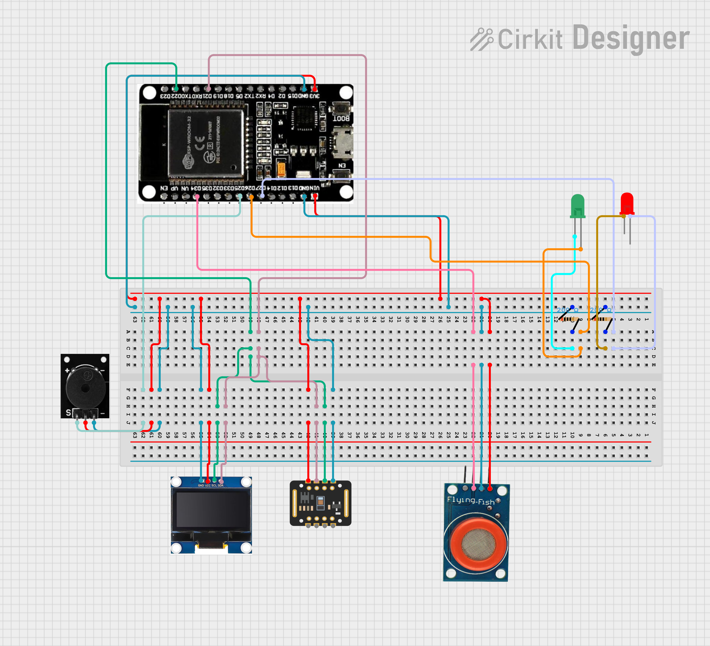
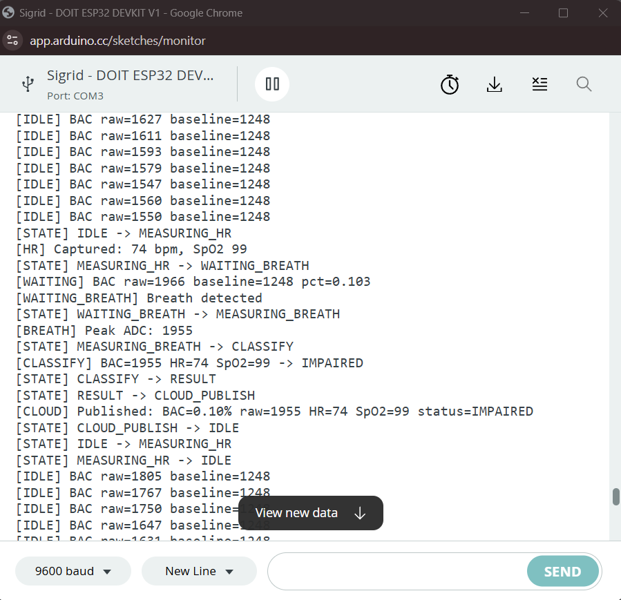
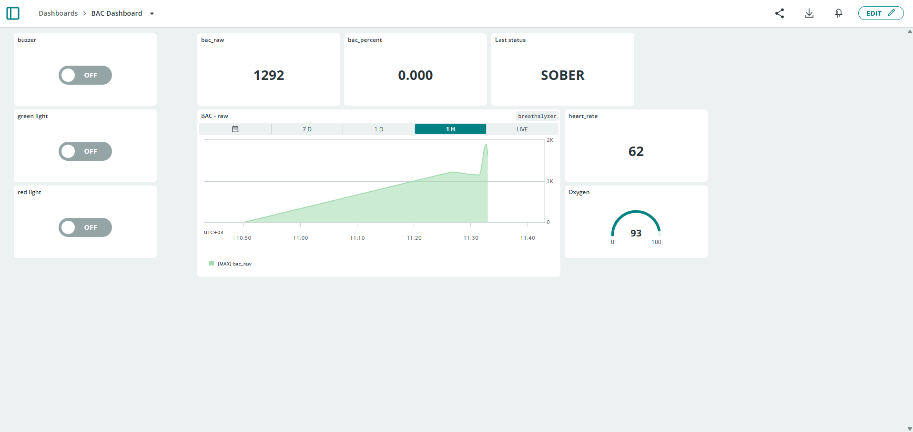
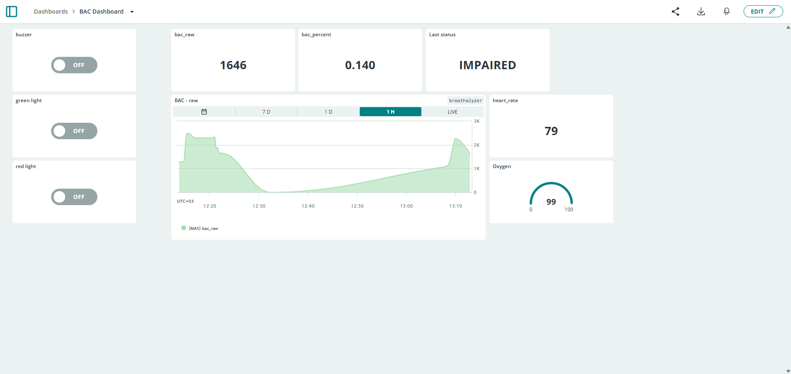
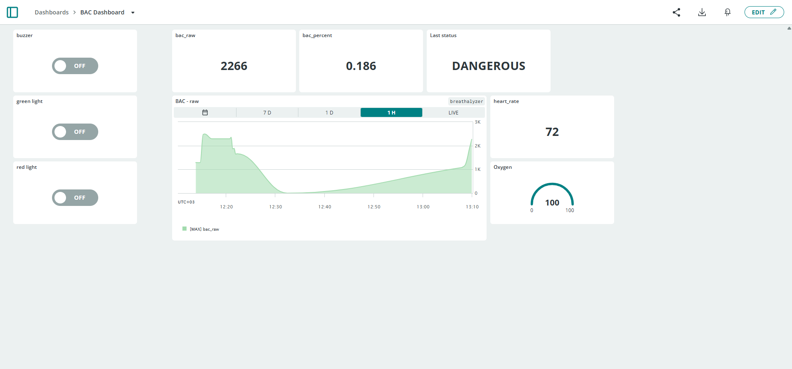
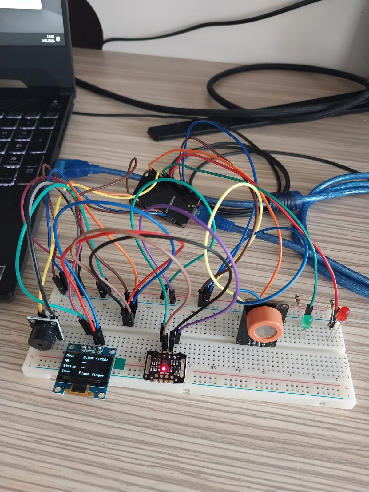

# IoT-Based Breath Alcohol Detection System with Pulse Verification

**Author:** Akın Tatar (20220808075)  
**Course:** CSE 328 — Internet of Things, Akdeniz University  
**Repo:** https://github.com/ak1nttr/iot-breathalyzer

---

## Project Summary

This project is a smart breathalyzer built on an ESP32 microcontroller that combines alcohol detection with physiological verification. A user first places their finger on a MAX30102 pulse oximeter — the device reads heart rate and SpO2 to confirm a real person is present and to factor their physiological state into the result. Only then is the user prompted to blow into the MQ-3 alcohol sensor. The system classifies the result into one of three tiers (Sober / Impaired / Dangerous) using both the BAC reading and the heart rate together, then signals the result via an OLED display, green/red LEDs, and a buzzer. All measurements are published to an Arduino IoT Cloud dashboard for remote monitoring. A tamper detection mechanism rejects attempts to blow into the sensor without first placing a finger. The sensor baseline adapts dynamically during idle periods to compensate for long-term heater drift in the MQ-3.

---

## Components

| Component | Model / Type | Role |
|---|---|---|
| **Microcontroller** | DOIT ESP32 DevKit V1 | Runs state machine, reads sensors, drives actuators, connects to cloud |
| **Sensor 1** | MQ-3 Alcohol Gas Sensor Module | Measures ethanol concentration in exhaled breath (analog output) |
| **Sensor 2** | MAX30102 Pulse Oximeter Module | Reads heart rate (BPM) and blood oxygen saturation (SpO2) via fingertip |
| **Display** | SSD1306 0.96" I2C OLED (128×64) | Shows live BAC, HR, status, and current step |
| **Actuator 1** | Active buzzer module | Short beep (impaired), alarm pattern (dangerous / tamper) |
| **Actuator 2** | Green LED | Solid on = SOBER result |
| **Actuator 3** | Red LED | Solid = IMPAIRED, fast blink = DANGEROUS |

---

## Wiring Table

| From | To | Notes |
|---|---|---|
| ESP32 GND | Breadboard `−` rail | Common ground |
| ESP32 3V3 | OLED VCC, MAX30102 VIN | 3.3 V for I2C peripherals |
| ESP32 5V | MQ-3 VCC | 5 V for heater-load components |
| **MQ-3** VCC | 5 V | Heater requires 5 V |
| **MQ-3** GND | GND rail | |
| **MQ-3** AO | ESP32 GPIO 34 | ADC1 channel — GPIO 34 is input-only, safe for ADC |
| **MQ-3** DO | unconnected | Digital threshold output not used |
| **MAX30102** VIN | 3.3 V | |
| **MAX30102** GND | GND rail | |
| **MAX30102** SDA | ESP32 GPIO 21 | I2C default SDA (shared with OLED) |
| **MAX30102** SCL | ESP32 GPIO 22 | I2C default SCL (shared with OLED) |
| **OLED** VCC | 3.3 V | |
| **OLED** GND | GND rail | |
| **OLED** SDA | ESP32 GPIO 21 | I2C shared bus (address 0x3C) |
| **OLED** SCL | ESP32 GPIO 22 | I2C shared bus |
| **Buzzer** `+` | ESP32 GPIO 25 | Active buzzer, driven directly from GPIO |
| **Buzzer** `−` | GND rail | |
| **Green LED** anode | ESP32 GPIO 26 (via 220 Ω) | |
| **Green LED** cathode | GND rail | |
| **Red LED** anode | ESP32 GPIO 27 (via 220 Ω) | |
| **Red LED** cathode | GND rail | |

> **Note:** MAX30102 and OLED share the same I2C bus. MAX30102 address is 0x57, OLED is 0x3C — no conflict.

### Wiring Diagram

Wiring diagram of the circuit with ESP32 and sensors and actuators:



---

## Arduino IoT Cloud Setup

**Platform:** Arduino IoT Cloud (Free plan)  
**Thing name:** `Breathalyzer`  
**Device:** ESP32 DevKit V1 registered as a third-party device  
**Network:** 2.4 GHz Wi-Fi

### Cloud Variables

| Name | Type | Permission | Update | Purpose |
|---|---|---|---|---|
| `bac_percent` | float | Read-only | On change | Final BAC estimate as a percentage (0.00–0.30%) |
| `bac_raw` | int | Read-only | On change | Raw ADC reading from MQ-3 (0–4095) |
| `heart_rate` | int | Read-only | On change | Measured heart rate in BPM |
| `spo2` | int | Read-only | On change | Blood oxygen saturation (%) |
| `status` | String | Read-only | On change | Classification result: `SOBER` / `IMPAIRED` / `DANGEROUS` |
| `last_test_time` | String | Read-only | On change | Uptime timestamp of the last completed test |
| `manual_buzzer` | bool | Read/Write | On change | Dashboard switch to manually activate the buzzer |
| `manual_red` | bool | Read/Write | On change | Dashboard switch to manually activate the red LED |
| `manual_green` | bool | Read/Write | On change | Dashboard switch to manually activate the green LED |

Manual control variables use logical OR with the device's own state — the dashboard can activate actuators without ever overwriting the device's internal state machine.

### Dashboard Widgets

| Widget | Linked Variable | Purpose |
|---|---|---|
| Value | `bac_percent` | Live BAC % reading |
| Value | `bac_raw` | Live raw ADC value |
| Chart | `bac_percent` | BAC trend over time |
| Value | `heart_rate` | Last measured HR |
| Value | `spo2` | Last measured SpO2 |
| Value / Label | `status` | Latest classification result |
| Value | `last_test_time` | Timestamp of last test |
| Switch | `manual_buzzer` | Force-activate buzzer remotely |
| Switch | `manual_red` | Force-activate red LED remotely |
| Switch | `manual_green` | Force-activate green LED remotely |

### Screenshots

Serial monitor output showing state machine transitions during a full test cycle:



Arduino IoT Cloud dashboard after a completed test — SOBER result with normal HR and SpO2:



Arduino IoT Cloud dashboard after a completed test — IMPAIRED result:



Arduino IoT Cloud dashboard after a completed test — DANGEROUS result:



---

## Required Libraries

Install via the Arduino Cloud Editor library manager:

- `ArduinoIoTCloud` — Arduino IoT Cloud connectivity
- `Arduino_ConnectionHandler` — Wi-Fi connection management (dependency of ArduinoIoTCloud)
- `Adafruit SSD1306` — OLED display driver
- `Adafruit GFX Library` — graphics primitives
- `Adafruit BusIO` — I2C/SPI transport layer
- `SparkFun MAX3010x Pulse and Proximity Sensor Library` — MAX30102 driver

### Board Settings

- **Board package:** ESP32 by Espressif Systems v2.0.x
- **Board type:** ESP32 Dev Module
- **Upload speed:** 921600 baud
- **Serial monitor baud:** 9600


---

## How It Works

### Data Flow

```
[MAX30102] ──→ HR + SpO2 ──┐
                            ├──→ ESP32 State Machine ──→ OLED + LEDs + Buzzer
[MQ-3]     ──→ BAC raw   ──┘         │
                                     └──→ Arduino IoT Cloud ──→ Dashboard
```

### State Machine (8 States)

The firmware is a non-blocking state machine. Each state handler runs once per `loop()` iteration alongside `ArduinoCloud.update()` and `feedback_update()`.

```
IDLE ──(finger placed)──→ MEASURING_HR ──(valid HR+SpO2)──→ WAITING_BREATH
  ↑                              │                                  │
  │                    (finger removed)               (breath detected / 30s timeout)
  │                              ↓                                  ↓
  │                            IDLE                       MEASURING_BREATH
  │                                                                 │
  │                                                         (5 s elapsed)
  │                                                                 ↓
  └──(15s cooldown)──← CLOUD_PUBLISH ←── RESULT ←── CLASSIFY ←─────┘

IDLE ──(no-finger blow > 8× baseline)──→ TAMPER_REJECT ──→ IDLE
```

| State | What Happens |
|---|---|
| `IDLE` | Watches for finger on MAX30102. Reads MQ-3 every 500 ms for tamper detection and live OLED display. Updates dynamic baseline. Warns with red LED + beep if ambient BAC is already in IMPAIRED range. |
| `MEASURING_HR` | Collects 5 consecutive valid MAX30102 readings and averages them for a stable HR + SpO2. |
| `WAITING_BREATH` | Prompts user to blow. Streams live BAC to OLED and cloud every 500 ms. Times out after 30 s — a timeout classifies as SOBER (no alcohol detected = ambient = sober). |
| `MEASURING_BREATH` | Tracks the peak MQ-3 reading over 5 seconds. Updates OLED in real time. |
| `TAMPER_REJECT` | Fires alarm and red LED for 3 s. A 15 s cooldown follows before accepting a new test. |
| `CLASSIFY` | Combines BAC peak, HR, and SpO2 into a final classification (see logic below). |
| `RESULT` | Displays result on OLED, triggers LED + buzzer feedback pattern. Holds for 10 s. |
| `CLOUD_PUBLISH` | Writes all variables to Arduino IoT Cloud, then resets and returns to IDLE. |

### Classification Logic

```
BAC peak > baseline × 1.61                                → DANGEROUS  (regardless of HR/SpO2)
BAC peak > baseline × 1.37 AND SpO2 < 94%                → DANGEROUS  (respiratory suppression)
BAC peak > baseline × 1.37                                → IMPAIRED
BAC peak ≤ baseline × 1.37 AND 40 ≤ HR ≤ 100 BPM        → SOBER
BAC peak ≤ baseline × 1.37 AND HR outside 40–100         → IMPAIRED
```

BAC percentage is computed by linear interpolation across three ADC ranges (thresholds scale with the dynamic baseline):

| ADC Range | BAC % Range |
|---|---|
| baseline → baseline × 1.37 | 0.00 % → 0.08 % |
| baseline × 1.37 → baseline × 1.61 | 0.08 % → 0.15 % |
| baseline × 1.61 → 4095 | 0.15 % → 0.30 % |

### Feedback Patterns

| Result | Green LED | Red LED | Buzzer |
|---|---|---|---|
| SOBER | Solid ON | OFF | Silence |
| IMPAIRED | OFF | Solid ON | Single short beep |
| DANGEROUS | OFF | Fast blink (300 ms) | 3× alarm burst |
| TAMPER | OFF | Solid ON | 3× alarm burst |

All LED and buzzer operations are non-blocking — driven by a state engine inside `feedback_update()` called every loop iteration. The `||` combination with `manual_*` cloud variables means dashboard overrides and device-driven state never conflict.

### OLED Display Layout

```
┌────────────────────────────────┐
│ BAC:   0.03% (1124)            │
│ HR:    72bpm 98%               │
│ Status: ---                    │
│ Step:  Blow now (12s)          │
└────────────────────────────────┘
```

The BAC row shows both the computed percentage and the raw ADC value in parentheses for live monitoring. The HR row shows heart rate and SpO2 together. The Step row reflects the current state machine phase.

---

## Key Design Decisions

These are configuration values that were arrived at through testing and calibration, not arbitrary defaults.

**`MQ3_BREATH_DETECT_FACTOR = 1.05`**  
The MQ-3 is a gas sensor, not an airflow sensor. An alcohol-free breath raises the reading by 5–10% from humidity and warmth alone. The detection threshold was initially 3.0× (a common textbook value), which caused the device to never detect any breath at all. It was reduced to 1.05× so any exhalation — with or without alcohol — reliably triggers the transition to `MEASURING_BREATH`.

**`HR_NORMAL_MIN = 40 BPM`**  
Fit individuals and athletes commonly have resting heart rates below 60 BPM. With the original lower bound of 60, a resting HR of 52 would incorrectly trigger `IMPAIRED` on an otherwise sober person. The limit was lowered to 40 BPM to align with the clinical definition of bradycardia rather than population averages.

**`BAC_LOW_FACTOR = 1.37×`, `BAC_MEDIUM_FACTOR = 1.61×` (factor-based thresholds)**  
Fixed ADC thresholds (originally 1700 / 2500) failed in practice: with a baseline of ~1240 after warmup, the DANGEROUS ceiling of 2500 was physically unreachable. Switching to baseline-relative factors means the classification bands scale with wherever the sensor settles after warmup, keeping all three tiers reachable regardless of thermal drift. The factors were chosen so that at a typical baseline they land close to the original intended BAC% boundaries (0.08 % and 0.15 %).

**Dynamic Baseline (0.95 / 0.05 exponential moving average, gated)**  
The MQ-3 heater causes the sensor resistance — and thus the ADC reading — to drift downward continuously as it warms up. Baseline readings of 900 ADC at startup can settle at 650–700 ADC after 30 minutes. A fixed post-calibration baseline would make the BAC calculation increasingly inaccurate over time. The moving average (`new = old × 0.95 + reading × 0.05`) corrects for this slow thermal drift. Critically, the update is gated: it only runs when the current reading is within 2% of the current baseline. If alcohol is present in ambient air, the baseline freezes and the full signal delta is preserved as a real measurement instead of being absorbed into the baseline.

**`TIMEOUT_WAITING_BREATH_MS = 30 s` → classify as SOBER**  
If a user places their finger but does not blow within 30 seconds, the original behavior silently reset the device. This was changed: a timeout now classifies as SOBER and publishes to the cloud. The reasoning is that `mq3_isBreathDetected()` (threshold: baseline × 1.05) would have automatically fired during the 30-second window if any alcohol-elevated breath was present near the sensor. No detection over 30 seconds is strong evidence of a sober ambient environment.

**`MQ3_SAMPLE_COUNT = 5`, `MQ3_SAMPLE_DELAY_MS = 5 ms`**  
Originally 10 samples × 10 ms = 100 ms per `mq3_readRaw()` call. Every state that reads the MQ-3 blocked for 100 ms, making the OLED refresh and breath detection response noticeably sluggish. Halving both values reduces blocking time to 25 ms with no meaningful accuracy loss — the ESP32 ADC noise is well-covered by 5-sample averaging.

**`MQ3_TAMPER_DETECT_FACTOR = 8.0×`**  
Spraying alcohol directly at the sensor (without a finger placed) spikes the reading to 6–8× baseline instantly. Normal breath raises it by ~1.05×. The 8.0× threshold sits cleanly above both cases and reliably identifies hardware-level tampering attempts without false-triggering on legitimate use.

---

## Evidence

### Device Photo

Whole circuit scheme with each sensor and actuator in full functioning
> 


---

